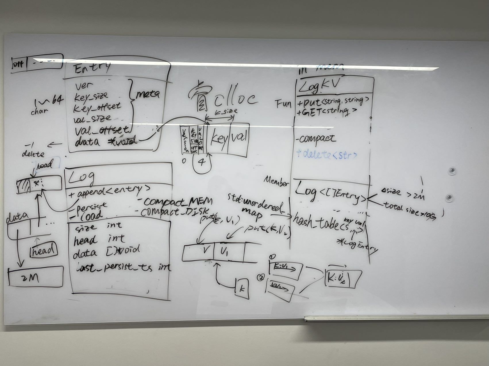

# Log Key-Value Store

## Overview
In this project, we want to compare the advantage of log-based key-value store over the naive key-value store.

We will start with one key-value table setting.

The log-based key-value store will maintain a log of all changes happened to the key-value table. The log will be dumped into the disk in a manner that combines periodical and max-log-size triggered strategies. In the light of saving space both in the memory and the disk, the log will have two levels of compactions, in-memory and disk. Upon failure, the key-value table will be recovered with replaying the log stored in the disk.

In terms of naive key-value store, it is will be implemented simply using a hash table. To support durability, it will be stored by taking periodic screen shots.

We are especially interested in evaluating the throughput, memory utilization, response latency, and fault-tolerance (recovery speed and completeness) of the two approaches.

## The Goal of this project
We try to examine the differences between log-structure kv store with traditional kv store design like std::unordered_map in the following aspects:
- Performance (Single W/R or concurrent W/R).
- persistency (How long does it take to persist to non-volatile storage).
- Time to Recovery from failure.
- Data lost rate when failure happens.

## Why log-kv
Each entry will only be appended to the log, which may promise good performance under high concurrency. With log-structure, we may bulk allocate memory instead of allocate small chunk for many times, which may bottleneck the overall performance.

## Supported data
- key: random string at most 64 Bytes.
- value: random string at most 1Mb.

## Supported operations
- Put(k, v)
- Get(k) 
- Delete(k)

## Data Model

## Road Map
- [ ] :bangbang: Basic Data structure 
- [ ] :bangbang: Comparison between std::unordered_map and ours
- [ ] :bangbang: Persist method
- [ ] :heavy_exclamation_mark: Snapshot for fast recovery
- [ ] :interrobang: Point in Time Recovery